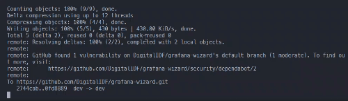

# merge

automate the next steps:
1. git add -A
2. git commit -m <arg[0]>
3. git push
4. open pr
5. wait for required workflows to run
6. git merge

## Usage

merge run "<commit message>"




## Installation

### Linux/Mac

```sh
    # Download the latest release of the binary
    curl -L https://api.github.com/repos/oshri22004/merge/releases/latest | jq -r '.assets[].browser_download_url' | xargs wget

    # Move the binary to /usr/local/bin
    sudo mv merge /usr/local/bin/

    # Make the binary executable
    sudo chmod +x /usr/local/bin/merge

    # setup
    merge setup
```
